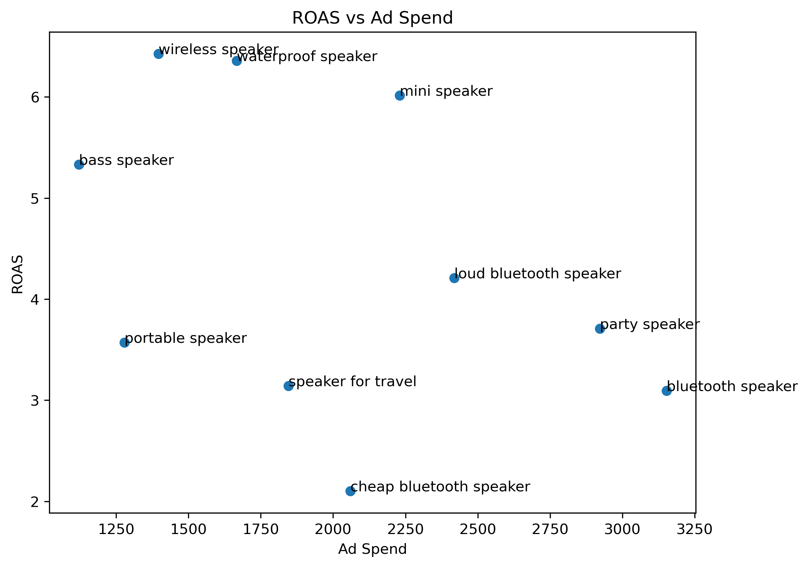
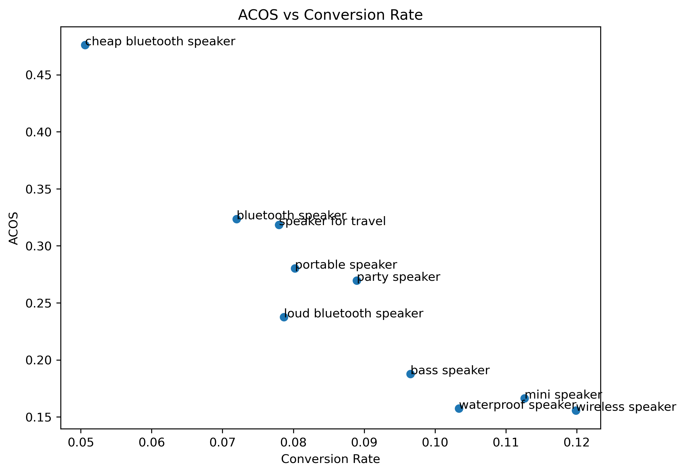

# Amazon Advertising Keyword Analysis

## Overview

This project analyses Amazon advertising keyword performance using Python.

The goal is to identify profitable keywords and wasted advertising spend.

## Tools Used

- Python
- Pandas
- Matplotlib
- Jupyter Notebook

## Dataset

The dataset contains advertising performance data for Amazon keywords including:

- Clicks
- Spend
- Orders
- Sales

## Sample Data

| Keyword | Clicks | Spend | Orders | Sales |
|--------|--------|-------|--------|-------|
| mini speaker | 2131 | 2229 | 240 | 13410 |
| wireless speaker | 1343 | 1396 | 161 | 8971 |
| cheap bluetooth speaker | 2134 | 2059 | 108 | 4326 |  

## Metrics Analysed

- CPC (Cost Per Click)
- Conversion Rate
- ACOS
- ROAS

## Key Findings

Best performing keywords:
- wireless speaker
- mini speaker
- waterproof speaker

Underperforming keyword:
- cheap bluetooth speaker

Recommendation:
Increase bids for high performing keywords and reduce spend on inefficient ones.

## Visualisations

### ROAS vs Ad Spend

This chart compares advertising spend with return on ad spend (ROAS).

### ACOS vs Conversion Rate

## Business Recommendations

Based on the analysis:

Scale advertising spend for:
- wireless speaker
- mini speaker
- waterproof speaker

These keywords show strong conversion rates and high ROAS.

Monitor performance for:
- bass speaker
- loud bluetooth speaker

Reduce bids or pause advertising for:
- cheap bluetooth speaker
